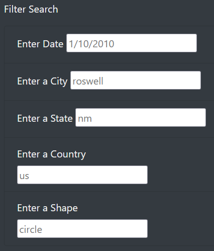
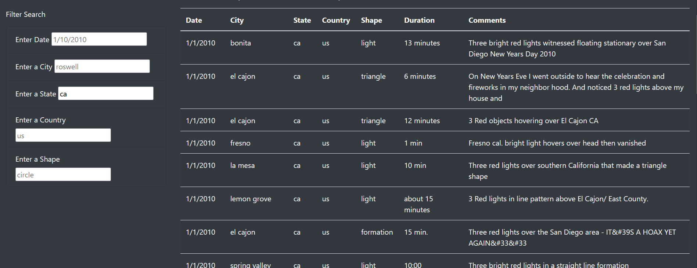
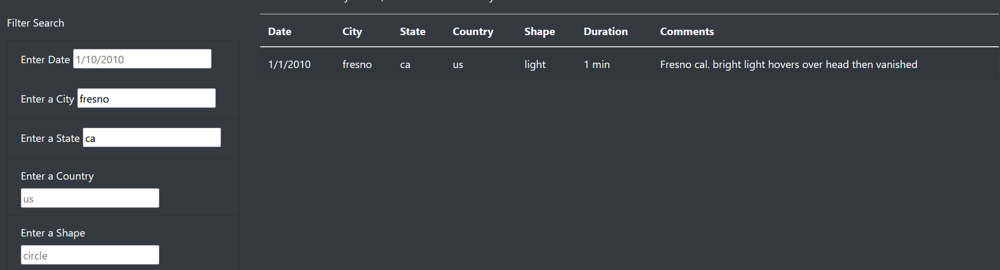

# UFOs

## Overview
Update Dana's website to provide a more in-depth analysis of UFO sightings.

## Purpose
The purpose is to provide a more in-depth analysis of UFO sightings by allowing users to filter for multiple criteria at the same time.

## Process
First, we need to increase the number of filters available to the user. In addition to the date, we’ll add table filters for the city, state, country, and shape.

With these additional filters we can now narrow our searches. Here is the table filtering for events in California.

Then we can also filter further by city, here we chose Fresno.

## Summary
The filter have been employed and they are working as intended. One of the drawbacks, the user has to scroll through the list or guess, when choosing what to set the filters for. To solve this, we could use dropdown menus on the filter fields, to show available options based on the data in the table. Another recommendation is to add an option for reporting events, that can be vetted and upon confirmation, added to the table.